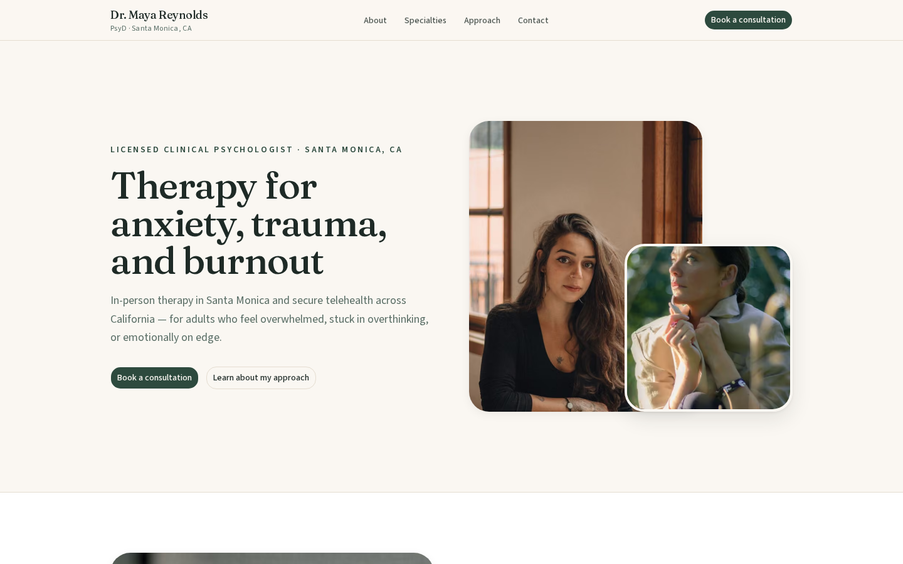
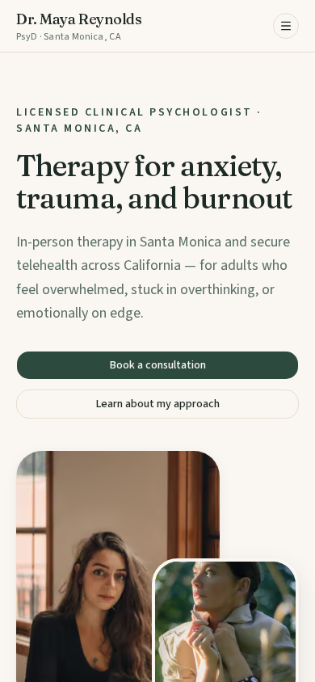

# Therapist Website Redesign — a design & engineering case study

> **Disclaimer:** Dr. Maya Reynolds is a **fictional persona** created for this
> case study. This is not a real practice, the contact form sends nothing, and
> nothing here should be mistaken for a real clinician's booking page.

A from-scratch rebuild & re-theme of a real-world therapy-practice homepage
layout with new visual identity, new information architecture for a solo
practitioner and production-grade engineering throughout.

- **Live:** https://therapist-site-redesign-phi.vercel.app/
- **Design system demo:** `/style-guide` (ships with the site as evidence of
  deliberate token thinking).

## The problem I set out to solve

The reference layout belonged to a **multi-therapist practice**: team
dropdowns, a 9-person roster, specialty index pages. My subject is a **solo
practitioner**. The core design problem was *adaptation, not replication*: I kept the proven
section rhythm (hero → empathy → proof → specialties → conversion) while
collapsing everything roster-shaped into a single voice.

Key adaptations:

| Reference pattern | What shipped | Why |
|---|---|---|
| "Our Team" dropdown, 9-person roster | Single "About Dr. Reynolds" nav + bio line | Solo practice; no fake people |
| Specialties/Methods dropdowns to detail pages | Anchor-linked pill tags + in-page grid | Single-page site; no phantom pages |

## Tech stack

| Layer | Choice |
|---|---|
| Framework | Next.js 16, App Router, Turbopack |
| Language | TypeScript, strict mode |
| Styling | Tailwind CSS v4, CSS-first `@theme` tokens |
| Components | shadcn/ui on Base UI primitives |
| Forms | react-hook-form + zod, shared client/server schema |
| Content | Typed `content/site.ts` — zero hardcoded copy in components |
| Images | `next/image`, self-hosted, AVIF-first, blur placeholders |
| Testing | Vitest + Testing Library, one Playwright smoke test |
| CI | GitHub Actions: lint → typecheck → test → build → e2e |
| Hosting | Vercel (pending) |
| Package manager | pnpm |

## Lighthouse scores (production build)

| | Mobile | Desktop |
|---|---|---|
| Performance | 91 | 100 |
| Accessibility | 100 | 100 |
| Best Practices | 100 | 100 |
| SEO | 100 | 100 |

Measured in Brave against the production build (`pnpm start`): mobile FCP
0.9s / LCP 2.9s / TBT 230ms / CLS 0 / SI 0.9s; desktop FCP 0.3s / LCP 0.6s /
TBT 0ms / CLS 0 / SI 0.3s. Accessibility was additionally covered by a
static audit (one `h1` per route, named landmarks, labeled controls,
announced form errors, AA-computed contrast pairs) plus a full manual
keyboard pass. How the 90+ was earned: code-split below-the-fold islands (form
validation chain, mobile dialog), dual-priority hero images, AVIF-first
delivery, a 1.5MB→90KB portrait recompress, and zero third-party requests.

## What I'd add with more time

- Real send-through on the contact form (Resend) + rate limiting + honeypot.
- Per-specialty detail pages with FAQ schema.
- Dark mode on the same token system (deferred for now).
- `next/og` dynamic social images per route.
- Vercel Web Analytics (privacy-friendly, opt-in).

## Credits

- Portrait and office photography: (license
  unverified).
- Section photography: [Pexels](https://www.pexels.com/license/) (free
  license), including work by Mayara Caroline Mombelli and Yi Ren; remaining
  artists credited via their Pexels photo pages.
- Type: [Fraunces](https://fonts.google.com/specimen/Fraunces) +
  [Source Sans 3](https://fonts.google.com/specimen/Source+Sans+3) (SIL Open
  Font License 1.1), self-hosted via `next/font`.
- Icons: [Lucide](https://lucide.dev/) (ISC). UI primitives: shadcn/ui +
  Base UI (MIT). Framework: Next.js (MIT).

## License

MIT — see [LICENSE](LICENSE).
